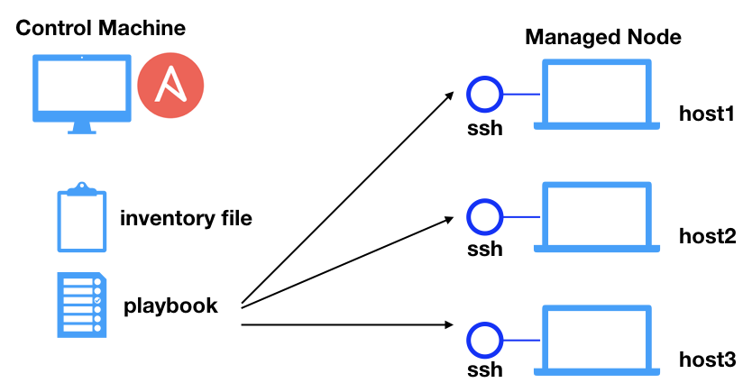

# Ansible

- [Sobre o Ansible](#whatis)
- [Control Node x Managed Node](#control-managed)
- [Inventário](#inventory)
- [Módulos](#modules)
- [Comandos AdHoc](#ad-hoc)
- [Playbooks](#playbooks)
- [Roles](#roles)
- [Tutorial](tutorial.md)
- [Diretório com automações de exemplo](examples/lab/)

<br/>

## Sobre o ansible <a name="whatis"></a>

- Ferramenta para automação de tarefas em servidores e/ou dispositivos de rede, apis e etc.
- Agentless/push based model
- Oferece a opção de trabalhar no modelo de pull usando o ansible-pull no cron das máquinas.

<br/>

## Control Node x Managed Node <a name="control-managed"></a>

<br/>

### Control Node
- Máquina utilizada para execução do ansible ou ansible-playbook, que será responsável por se conectar nos managed nodes e executar as tasks.
- Qualquer máquina com python instalado pode ser  ( exceto windows ).

<br/>

### Managed Node

- Dispositivos de rede e/ou servidores que serão gerenciados via ansible.
- O ansible não é instalado nos managed nodes.

<br/>



<br/>

## Inventário <a name="inventory"></a>

<br/>


O Ansible é uma ferramenta de automação agentless, e a informação dos servidores ou dispositivos nos quais as tarefas devem ser executadas são fornecidas através de inventários.

É possível listar os plugins de inventário disponíveis executando o ansible-doc com o parametro -t inventory, conforme abaixo.

<br/>

```bash
ansible-doc -t inventory -l
```

<br/>

E para consultar a documentação de cada plugin execute o comando:

<br/>

```bash
ansible-doc -t inventory yaml
```


Estes inventários podem ser **estáticos** ou **dinâmicos**.

### [Inventários estáticos](examples/inventories/static/)

Para este tipo de inventário você adiciona em um arquivo os ips e variáveis de cada servidor ou dispositivo.

<br/>

### [Inventários dinâmicos](examples/inventories/dynamic/)

O Plugin ou script busca de forma dinâmica os ips e variáveis.

<br/>


### Verificando um inventário.

```yaml
# Lista os hosts e variáveis de um arquivo de inventário
ansible-inventory -i test.yml --list

#Lista os hosts e variáveis de todos inventários dentro de um diretório
ansible-inventory -i inventory_dir --list

```

### Atribuindo variáveis a hosts e grupos.

Nos arquivos de inventário é possível atribuir variáveis tanto para hosts quanto para grupos.

Isso pode ser feito tanto no mesmo arquivo onde os hosts estão definidos, quanto em diretórios específicos de cada grupo

### host_vars e group_vars.

Embora você possa definir as variáveis nos arquivo principal de inventário, pode ser mais fácil separar as variáveis em arquivos diferentes.
O Ansible carrega as variáveis de host e grupo procurando no path do próprio inventário.

Isso é útil quando o inventário está se tornando muito grande, ou você precisa usar o ansible-vault.


### ansible-vault

O Ansible-vault faz a criptografa de variáveis ou arquivos com uma senha solicitada após execução do comando

```bash
ansible-vault encrypt inventory/group_vars/prod/credentials.yaml
```

A senha que deve ser utilizada para criptografar pode ser lida de um arquivo informado via linha de comando, variável de ambiente, ou até mesmo na configuração global do ansible.


## Módulos <a name="modules"></a>

São scripts python que utilizados pelo ansible ou ansible-playbook.

Cada módulo serve para uma tarefa específica, alguns exemplos:

- Criar usuários
- Configurar vlans

## Comandos Ad-hoc  <a name="ad-hoc"></a>

- É um comando para executar uma única tarefa em um ou mais managed nodes
- Deve ser usado apenas para tarefas que não são muito repetidas.


## Playbooks <a name="playbooks"></a>

- Arquivo escrito em formato yaml que possui um ou mais ‘plays’ em uma lista ordenada
- Playbooks e plays são analogias do esporte, onde cada “play” executa parte do objetivo do playbook.


### Estratégia e Batch Size


```bash

- hosts: all
  strategy: free
  serial: 1
  tasks:
  # ...
```

[https://docs.ansible.com/ansible/latest/user_guide/playbooks_strategies.html#playbooks-strategies](https://docs.ansible.com/ansible/latest/user_guide/playbooks_strategies.html#playbooks-strategies)

## Roles <a name="roles"></a>

As roles permitem o carregamento de variáveis, arquivos, tarefas e handlers de uma forma agrupada em uma estrutura de diretórios.

Abaixo um exemplo de uma role com o nome app

